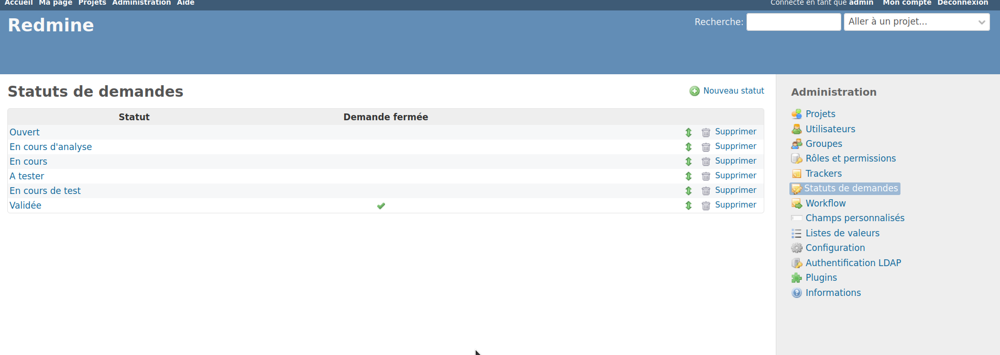
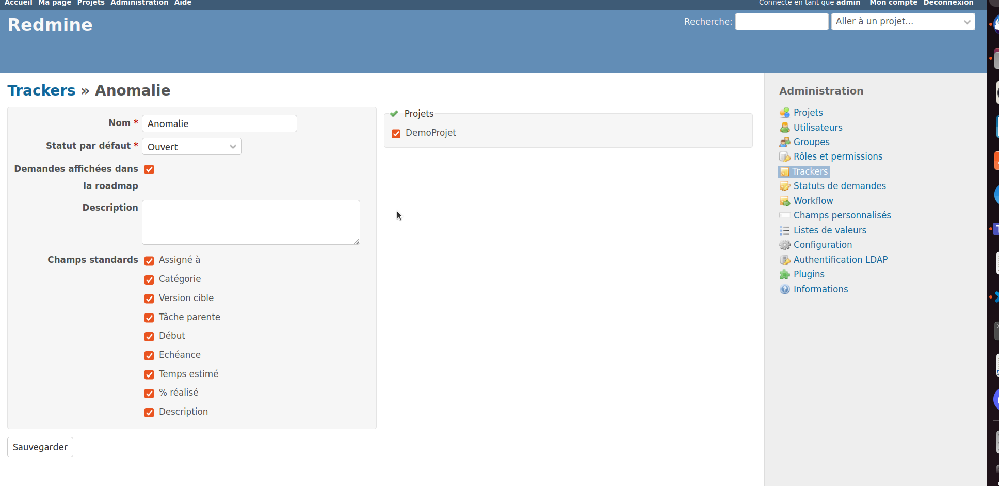
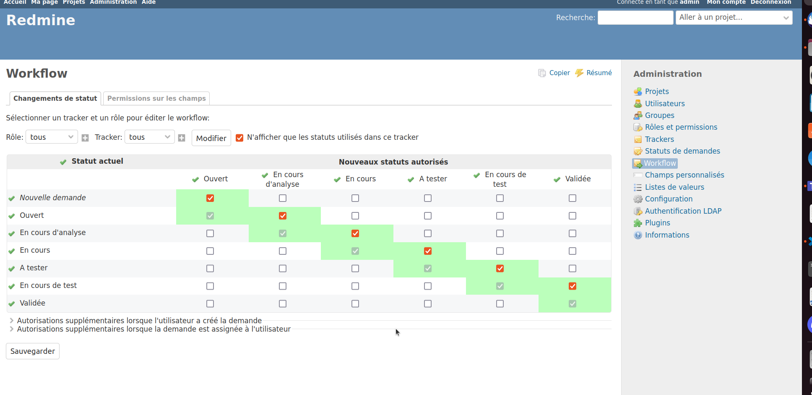
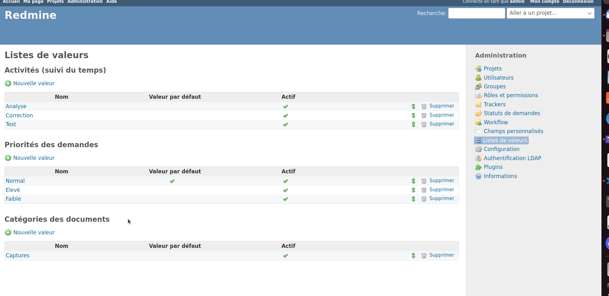
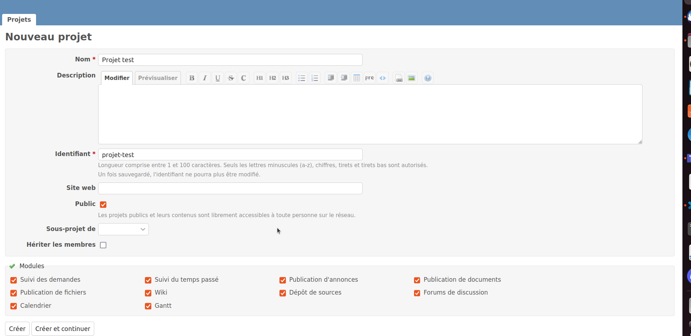
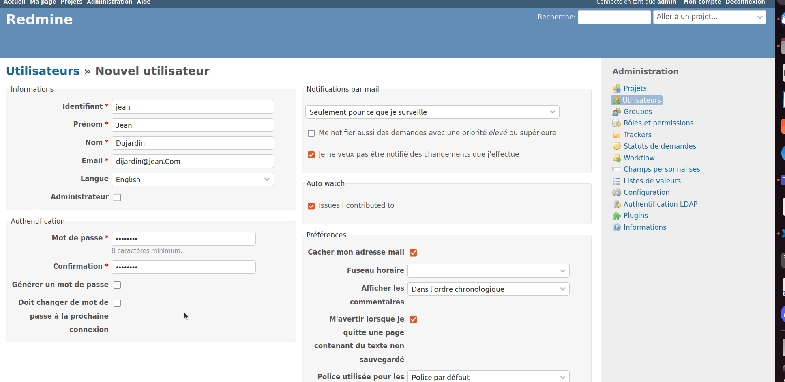

# Configuration de redmine

## Objectifs
Cet exercice a pour objectifs :
* de configurer les types de demandes, les champs, les statuts, les workflow
* de créer un premier projet sur redmine
* de créer un utilisateur 

## Pré-requis

* Avoir accès à Redmine en tant qu'administrateur

## Configurer son redmine

### Définition du statut
* Une fois connecter aller dans Administration
* Commencer par cliquer sur `Statut des demandes`
* Définir les statut que peuvent avoir vos demandes, par exemple :
    * Ouvert
    * En cours d'analyse
    * En cours
    * A tester
    * Validé 
* Associé au moins un de ses statut à une demande fermée 

### Définition des trackers
* Toujours dans l'administration aller dans tracker
* Créer au moins un type de tracker, chez nous nous avons crée le tracker Anomalie

* Choisir les champs à activer sur le tracker, son nom et le statut par défaut des demandes du tracker

### Définition des workflow
* Dans l'administration, nous allons maintenant définir le workflow
* Nous avons ajouter un workflow à notre tracker Anomalie et selectionné les passages de statut à un autre que nous souhaitions autorisé

### Définition des valeurs

* Dans l'administration, aller dans Listes de valeurs
* Définir des valeurs pour les activités, la priorité des demandes et la catégorie des documents

## Créer son projet

* Dans la page projet cliquer sur + Nouveau projet
* Remplir le nom et choisir les fonctionnalités à activer

## Créer un utilisateur

* Dans l'Administration, aller sur la page Utilisateurs
* Cliquer sur Nouvel utilisateur et remplir le formulaire

-> Votre Redmine est prêt à être utilisé