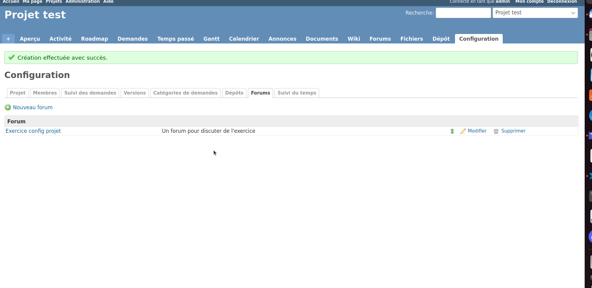

# Configurer son projet

## Objectifs

Cet exercice a pour objectifs :
* de savoir gérer les membres de son projet
* de pouvoir configurer son projet

## Ajouter un membre à votre projet

* Dans la page de configuration du projet, aller sur l'onglet Membre
* Cliquer sur + Nouveau membre, et sélectionner un utilisateur à ajouter au projet, ainsi que le rôle que vous voulez lui donner 

## Configuration des demandes

* Dans la configuration du projet, aller sur l'onglet Suivi des demandes, et vérifier que que le tracker créé à l'étape précédente est bien coché

## Gestion des versions

* Dans la configuration du projet, vous pouvez gérer les versions de votre projet
* Pour cela il faut définir les versions qui pourront être selectionné dans les demandes

## Catégorie de demandes

* Dans la configuration du projet, vous pouvez déterminer les catégories qui permettent de classer les demandes
* Il est nécessaire de les définir au plus tôt afin d'éviter d'avoir besoin de remodifier chaque demande

## Dépôts

* Pour associer un dépôt, il est indispensable que celui-ci soit configuré sur la machine hébergeant Redmine avant de le déclarer dans la configuration du projet (à demander à l'administrateur du serveur)
* Dans la configuration du projet, nous pouvons ensuite associer notre dépôt afin d'obtenir des informations sur celui-ci

## Forum

* Nous pouvons pour chaque projet, définir des forums de discussions
* Pour cela dans la configuration, onglet Forum, cliquer sur + Nouveau Forum et définir le titre et la description du forum

## Suivi du temps

* Le dernier onglet de configuration permet de selectionner les types d'activités possible à choisir lors de la saisie du temps pour ce projet
